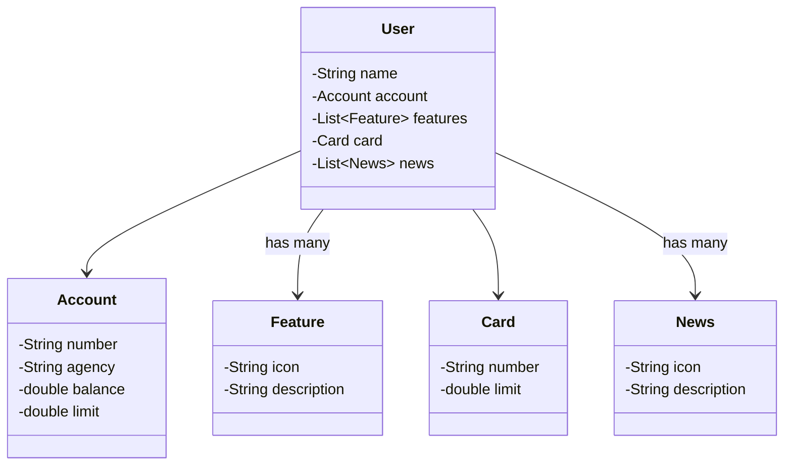

# Decola Tech 2025 - Avanade
## Desafio de criação de uma RESTful API em Java realizado durante o bootcamp da DIO

## Diagrama de Classes

```mermaid
classDiagram
    class User {
        -String name
        -Account account
        -List~Feature~ features
        -Card card
        -List~News~ news
    }

    class Account {
        -String number
        -String agency
        -double balance
        -double limit
    }

    class Feature {
        -String icon
        -String description
    }

    class Card {
        -String number
        -double limit
    }

    class News {
        -String icon
        -String description
    }

    User --> Account
    User --> Feature : has many
    User --> Card
    User --> News : has many
```
